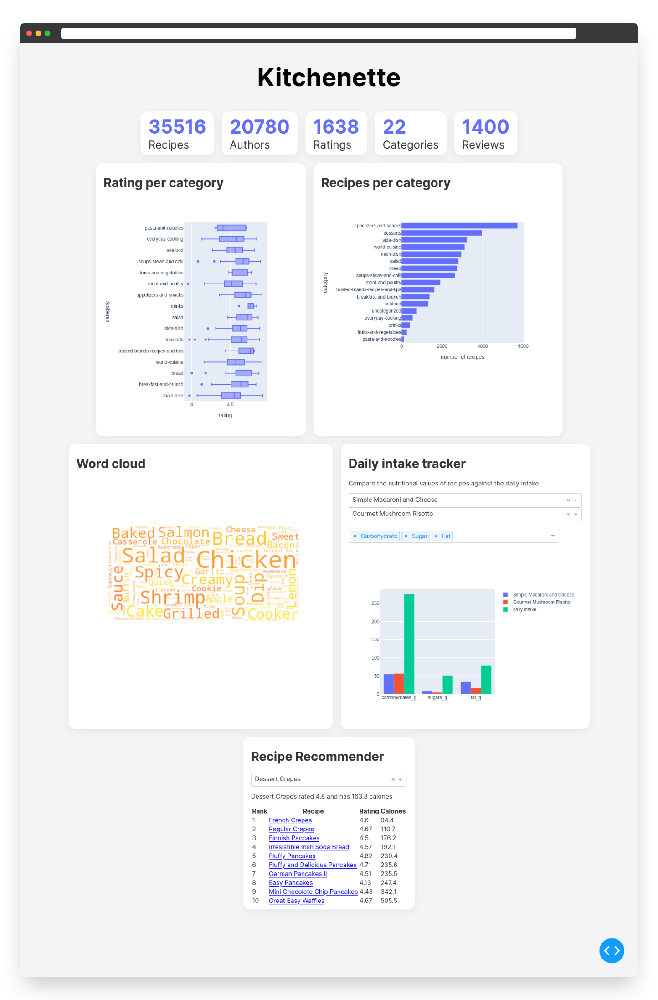

<h2 align="center"> Kitchenette </h2>

    <strong> 🥗 Provides insight into the nutritional value of various recipes and recommends healthier alternatives. </strong>  
    Data for the project was scraped using – <a href="https://github.com/shaansubbaiah/allrecipes-scraper">shaansubbaiah/allrecipes-scraper</a>  
    Uses Dash, Pandas, Plotly, Matplotlib, Wordcloud, Sklearn, Scrapy.

### Setup

1. Clone the repository
2. Install dependencies `pip install -r requirements.txt`
3. Run the app `python app.py`

### Preview

---

    Data Science Project by <a href="https://github.com/shaansubbaiah">@shaansubbaiah</a>, <a href="https://github.com/rushalishetty3">@rushalishetty3</a>, <a href="https://github.com/samrudhi-m">@samrudhi-m</a> and <a href="https://github.com/Ayyyman">@Ayyyman</a>.

